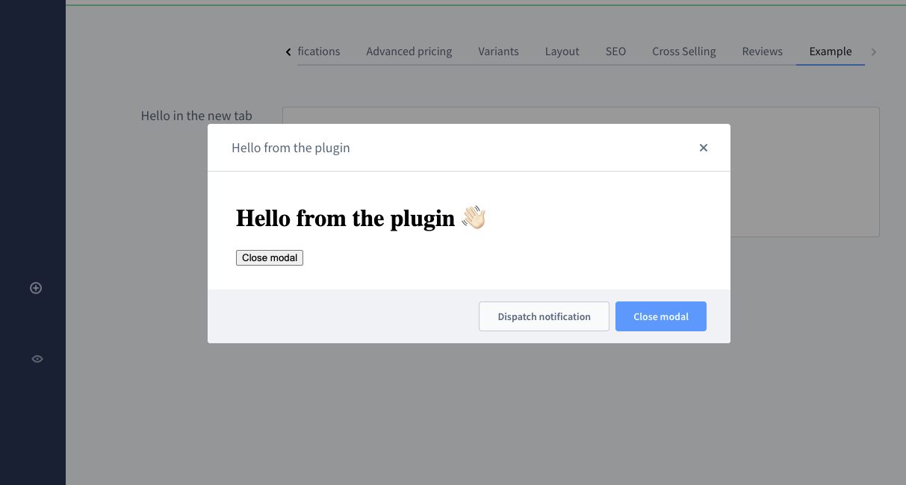

# Modals

A modal can be displayed in front of all other elements. To return to the main content the user must engage
with the modal by completing an action or by closing it. It should be mainly opened when the user interacts with something.
We recommend that no modal gets opened without context. As an example, it would be bad practice if the user gets logged
in and directly see some modals (e.g. changelogs of extensions) which all need to be closed manually.

### Open modal
Open a new modal in the current view. The content of the modal is determined by your `locationId`.

#### Usage:  
```ts
ui.modal.open({
    title: 'Your modal title',
    locationId: 'your-location-id',
    variant: 'large',
    showHeader: true,
    closable: true
    buttons: [
        {
            label: 'Dispatch notification',
            method: () => {
                notification.dispatch({
                    message: 'Hello from the modal',
                    title: 'Modal example'
                })
            }
        },
        {
            label: 'Close modal',
            variant: 'primary',
            method: () => {
                ui.modal.close({
                    locationId: 'your-location-id'
                })
            }
        }
    ],
})
```

#### Parameters
| Name         | Required | Default   | Description                                                                                                                                    |
| :----------- | :------- | :-------- | :--------------------------------------------------------------------------------------------------------------------------------------------- |
| `title`      | true     |           | The title of the modal                                                                                                                         |
| `locationId` | true     |           | The id for the content of the modal                                                                                                            |
| `variant`    | false    | 'default' | Determine the size of the modal. Possible values are 'default', 'small', 'large' and 'full'                                                    |
| `showHeader` | false    | true      | Enable the header in the modal which contains the title                                                                                        |
| `closable`   | false    | true      | If this is set to `false` then the modal can only be closed programmatically                                                                   |
| `buttons`    | false    | []        | This array contains [button configurations](../../../api/modules/ui_modal.md#buttonprops) which will render buttons in the footer of the modal |

#### Example

```ts
ui.modal.open({
    title: 'Hello from the plugin',
    locationId: 'my-awesome-app-hello-world-modal',
    buttons: [
        {
            label: 'Dispatch notification',
            method: () => {
                notification.dispatch({
                    message: 'Hello from the modal',
                    title: 'Modal plugin'
                })
            }
        },
        {
            label: 'Close modal',
            variant: 'primary',
            method: () => {
                ui.modal.close({
                    locationId: 'my-awesome-app-hello-world-modal'
                })
            }
        }
    ]
})
```

### Close modal
Closes an opened modal. You need use the correct `locationId` of the modal which should get closed.

#### Usage:  
```ts
ui.modal.close({ locationId: 'your-location-id' })
```

#### Parameters
| Name         | Required | Default | Description                                         |
| :----------- | :------- | :------ | :-------------------------------------------------- |
| `locationId` | true     |         | The locationId of the modal which should get closed |